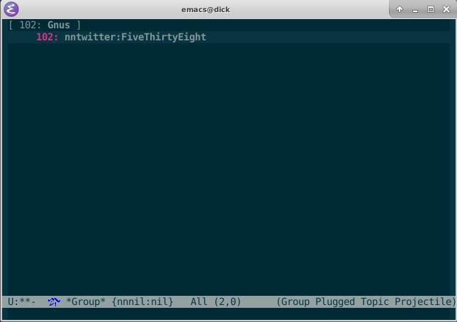

|build-status| |melpa-dev|

  Twitter: millions of users can't be wrong... or not.

A Gnus backend for Twitter.

.. |build-status|
   image:: https://github.com/dickmao/nntwitter/workflows/CI/badge.svg?branch=dev
   :target: https://github.com/dickmao/nntwitter/actions
   :alt: Build Status
.. |melpa-dev|
   image:: https://melpa.org/packages/nntwitter-badge.svg
   :target: http://melpa.org/#/nntwitter
   :alt: MELPA current version
.. |melpa-stable|
   image:: http://melpa-stable.milkbox.net/packages/ein-badge.svg
   :target: http://melpa-stable.milkbox.net/#/ein
   :alt: MELPA stable version

.. |--| unicode:: U+2013   .. en dash
.. |---| unicode:: U+2014  .. em dash, trimming surrounding whitespace
   :trim:

Install
=======
As described in `Getting started`_, ensure melpa's whereabouts in ``init.el`` or ``.emacs``::

   (add-to-list 'package-archives '("melpa" . "https://melpa.org/packages/"))

Then

::

   M-x package-refresh-contents RET
   M-x package-install RET nntwitter RET

Alternatively, directly clone this repo and ``make install``.

Usage
=====
In your ``.emacs`` or ``init.el``, use ONE of the following:

::

   ;; Applies to first-time Gnus users
   (custom-set-variables '(gnus-select-method (quote (nntwitter ""))))

or, if you're an existing Gnus user,

::

   ;; Applies to existing Gnus users
   (add-to-list 'gnus-secondary-select-methods '(nntwitter ""))

Then ``M-x gnus``.

Initial setup should guide you through OAuth and find your existing feeds.

Select a feed via ``RET``.  Rapidly catch yourself up via ``N`` and ``P``.  Instantly catch-up with ``c``.

From the ``*Group*`` buffer, press ``g`` to refresh all feeds.  ``M-g`` on a particular feed to refresh individually.

From the summary buffer, ``/o`` redisplays articles already read.  ``x`` undisplays them.

Gnus beginners may find the interface bewildering.  In particular, feeds with no unread articles do not display.  Use ``L`` to bring them out of hiding.

.. _walkthrough: https://github.com/dickmao/gnus-imap-walkthrough
.. _Cask: https://cask.readthedocs.io/en/latest/guide/installation.html
.. _Getting started: http://melpa.org/#/getting-started
.. _virtualenv: https://virtualenv.pypa.io/en/stable
.. _PRAW: https://github.com/praw-dev/praw/pull/1094
